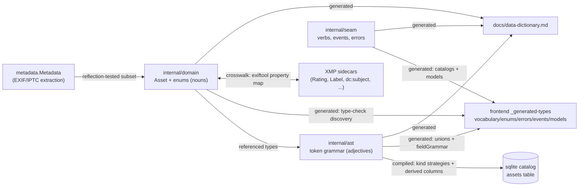

# Alexandria Data Dictionary

<!-- Code generated by cmd/generate; DO NOT EDIT. -->
<!-- Regenerate with `make generate` after changing internal/domain, internal/ast, or internal/seam. -->

Generated inventory of every shared vocabulary: the nouns, their enums, the
query grammar, the events, and the shared wire models. Concepts and
representation rules live in [vocabulary.md](vocabulary.md); this file is the
mechanical truth, regenerated from the Go declarations.

## The crosswalk map

How the canonical declarations project into every medium, and what enforces
each edge (generation = compile error on drift; tests = red CI; crosswalk =
hand-maintained against an external standard, reflection-tested).

## Filterable fields (the token grammar)

One row per `ast.Field`. Operators derive from kind + nullability; columns
derive from the field name (virtual fields compile through joins instead).

| Field | Kind | Nullable | Column | Operators | Suggestable |
|---|---|---|---|---|---|
| `cameraMake` | text | true | `camera_make` | eq, neq, contains, startsWith, empty, notEmpty | true |
| `cameraModel` | text | true | `camera_model` | eq, neq, contains, startsWith, empty, notEmpty | true |
| `caption` | text | true | `caption` | eq, neq, contains, startsWith, empty, notEmpty | false |
| `capturedAt` | dateRange | true | `captured_at` | within, notWithin, empty, notEmpty | false |
| `clippingHighlights` | numeric | true | `clipping_highlights` | eq, neq, gte, lte, empty, notEmpty | false |
| `clippingShadows` | numeric | true | `clipping_shadows` | eq, neq, gte, lte, empty, notEmpty | false |
| `colorLabel` | enum | true | `color_label` | in, notIn, empty, notEmpty | false |
| `copyright` | text | true | `copyright` | eq, neq, contains, startsWith, empty, notEmpty | true |
| `creator` | text | true | `creator` | eq, neq, contains, startsWith, empty, notEmpty | true |
| `fileStatus` | enum | false | `file_status` | in, notIn | false |
| `fileType` | enum | false | `file_type` | in, notIn | false |
| `filename` | text | false | `filename` | eq, neq, contains, startsWith | false |
| `flag` | enum | true | `flag` | in, notIn, empty, notEmpty | false |
| `height` | numeric | true | `height` | eq, neq, gte, lte, empty, notEmpty | false |
| `ingestedAt` | dateRange | false | `ingested_at` | within, notWithin | false |
| `lensModel` | text | true | `lens_model` | eq, neq, contains, startsWith, empty, notEmpty | true |
| `rating` | numeric | true | `rating` | eq, neq, gte, lte, empty, notEmpty | false |
| `sharpness` | numeric | true | `sharpness` | eq, neq, gte, lte, empty, notEmpty | false |
| `source` | entityReference | false | `source_id` | in, notIn | false |
| `tag` | tagReference | true | `— (virtual)` | has, lacks, under, notUnder, empty, notEmpty | false |
| `text` | freeText | false | `— (virtual)` | matches | false |
| `title` | text | true | `title` | eq, neq, contains, startsWith, empty, notEmpty | false |
| `width` | numeric | true | `width` | eq, neq, gte, lte, empty, notEmpty | false |

## Query shapes

- **ScopeKind**: `collection`, `folder`, `library`, `tag`
- **GroupOp**: `and`, `not`, `or`
- **SortField**: `capturedAt`, `filename`, `ingestedAt`, `rating`, `size`
- **SortDir**: `asc`, `desc`

## Domain enums

- **FileType**: `audio`, `document`, `image`, `raw`, `vector`, `video`
- **ColorLabel**: `blue`, `green`, `orange`, `purple`, `red`, `yellow`
- **Flag**: `pick`, `reject`
- **FileStatus**: `missing`, `offline`, `online`
- **SourceKind**: `external_drive`, `local`, `nfs`, `smb`
- **SourceConnectivity**: `offline`, `online`
- **EnrichmentKind**: `clipping`, `phash`, `sharpness`, `thumbnail`

## Events (C8) and errors

- **Topics**: `catalog`, `jobs`, `sync`, `watcher`
- **Event types**: `changed`, `done`, `historyChanged`, `progress`, `sourceStatus`
- **Job states**: `cancelled`, `done`, `failed`, `running`
- **ApiError kinds**: `degraded`, `domain`, `transport`, `unexpected`
- **Error codes**: `conflict`, `not_found`, `query_invalid`, `query_version_too_new`, `source_offline`, `validation`

## Shared wire models (models.ts)

Reflected from Go structs whose json tags are the wire contract.

- **AssetRow** (`internal/catalog`) — The slim grid-card projection. The seam adapter layers thumbURL + the kind discriminator on top.
- **AssetDetail** (`internal/seam`) — The full-asset detail projection GetAsset returns — the inspector's read.
- **Envelope** (`internal/seam`) — The one C8 event envelope.
- **CatalogChange** (`internal/seam`) — catalog/changed payload.
- **JobProgress** (`internal/seam`) — jobs/progress payload (C9).
- **JobSummary** (`internal/seam`) — Completion tally carried by JobDone.
- **JobDone** (`internal/seam`) — jobs/done payload.
- **HistoryState** (`internal/seam`) — catalog/historyChanged payload.
- **SourceStatus** (`internal/seam`) — watcher/sourceStatus payload.
